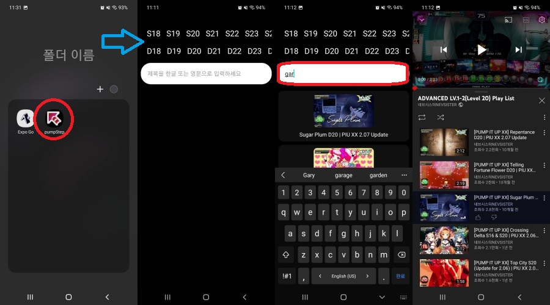

# Pump it up Youtube Link Application

## 🕹️ Project

1. 아케이드 게임 펌프잇업의 유튜브 링크 연결 애플리케이션
2. 프로젝트 기간 : 2021.11.02 ~ 2021.11.05 (4일)
3. 인원 : FrontEnd 1명
4. Python, Selenium, Javascript, ReactNative, expo

### Feature

1. 
2. 

## 📱 Demo
[구글 드라이브 링크](https://drive.google.com/drive/folders/1xwmWDeJbGnc4cCJIzDjwBO6qpj23luqI)  
### 링크에서 pumpStep_0.4_onlyAndroid 다운로드 후 설치 (안드로이드만 가능)

## 🕹️ Repository URL

#### FrontEnd

## 🕹️ Skills

### Frontend

</a>&nbsp;
</a>&nbsp;
</a>&nbsp;

### Tools

</a>&nbsp;

&nbsp;
